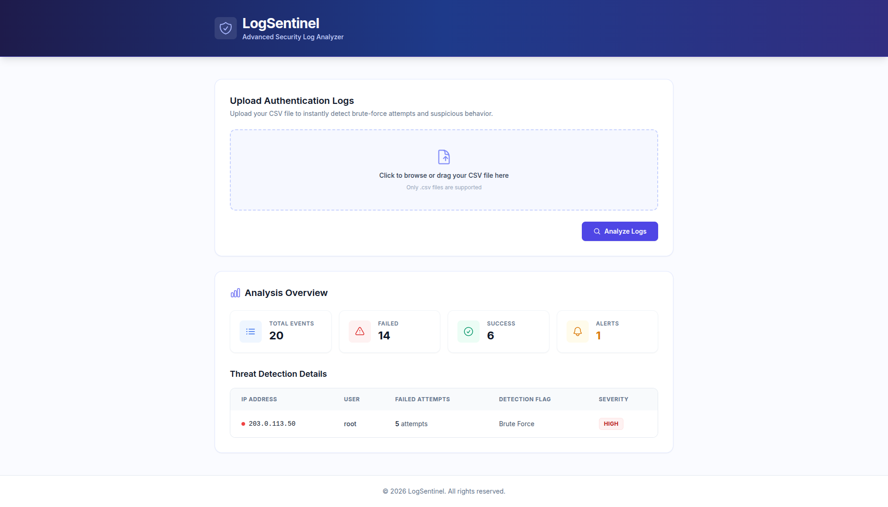

# LogSentinel 🛡️

**A lightweight Python + Django tool for spotting suspicious activity in authentication logs.**

LogSentinel scans authentication logs (CSV format) and flags patterns that usually mean trouble — repeated failed logins and brute-force attempts — the kind of thing a SOC analyst wants to catch early. It ships two ways to run it: a **command-line tool** for quick local scans, and a **Django web app** with a drag-and-drop upload UI for visual analysis in the browser.

---

## ✨ Why LogSentinel?

Most log-monitoring stacks are heavyweight, need external services, or are overkill for a single server or small team. LogSentinel keeps things simple:

- **Minimal dependencies** — the core detection engine only uses Python's standard library
- **Two interfaces** — a CLI for scripting/automation, and a web UI for point-and-click analysis
- **Fast to set up** — clone, install, run
- **Readable output** — findings are shown in plain, actionable language
- **Extensible** — the detection logic lives in a few small, well-documented modules

---

## 🔍 How It Works

LogSentinel's core pipeline lives in the `logsentinel/` package and runs in three steps:

1. **Parse** (`parser.py`) — reads the CSV log file, strips a BOM if present, normalizes column names, skips empty rows, and validates that the required columns (`timestamp`, `user`, `ip_address`, `status`) exist. If anything's missing, it raises a clear error instead of failing silently.

2. **Detect** (`detector.py`) — runs two checks over the parsed events:
   - `detect_failed_logins()` counts every event with `status = FAILED`.
   - `detect_brute_force()` groups failed attempts by `(user, ip_address)` pair and flags any combination that hits a threshold (default: **5 failed attempts**) as a `HIGH` risk alert, complete with a human-readable reason.

3. **Report** (`report.py`) — takes the totals and alerts and builds a formatted text summary, which is both printed to the console and saved to a report file.

The **web app** (`analyzer/` Django app) wraps this exact same pipeline behind a browser UI: you upload a CSV, Django saves it to a temp file, runs it through `parser.py` and `detector.py`, and renders the results (total events, successful/failed counts, and any brute-force alerts) directly on the page — no page reload, no separate report file needed.

---

## 🗂️ Project Structure